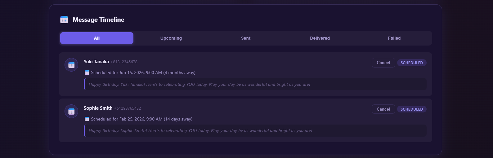
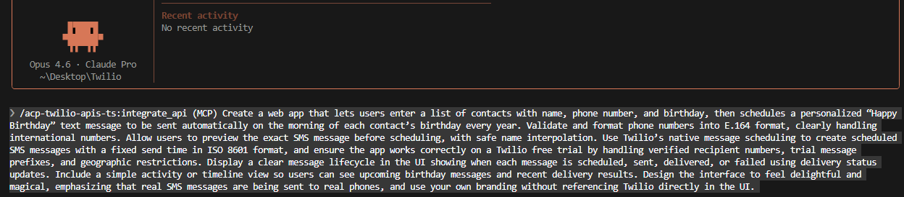

# BirthdayBuzz - Automated Birthday SMS App

A beautiful web application that lets you manage contacts and automatically send personalized "Happy Birthday" SMS messages using the Twilio API. Built with an APIMatic-generated TypeScript SDK for seamless Twilio integration.

## Demo

[Watch Video Demo](https://drive.google.com/file/d/10X6DDamplWr0QTZibX_QQFV2pT7szXSQ/view?usp=sharing)




## Features

- **Secure Credential Login** - Connect your own Twilio account via a login page. Credentials are masked and stored only in-memory for the session.
- **Contact Management** - Add contacts with name, phone number (international E.164 format), and birthday. Duplicate detection and smart country code handling included.
- **Automated Birthday Scheduling** - Messages are automatically scheduled for 9:00 AM on each contact's birthday, every year. A background cron job processes due messages each minute.
- **Real SMS Delivery** - Sends actual SMS messages through Twilio's Notify API with real-time status tracking (scheduled, sending, sent, delivered, failed).
- **Live Message Timeline** - View all messages in a filterable timeline with status badges, delivery timestamps, and the ability to cancel upcoming messages.
- **Instant Send** - Send a birthday message to any contact immediately with one click, in addition to the scheduled automatic delivery.

## Quick Start

### Prerequisites

- [Twilio Account](https://www.twilio.com/console) with Account SID, Auth Token, and a Messaging Service SID
- [Node.js 16+](https://nodejs.org/)
- Git

### Installation

```bash
# Clone the repository
git clone https://github.com/apimatic/TwilioSampleApp.git
cd TwilioSampleApp

# Install dependencies
npm install

# Build the project
npm run build

# Run the app
npm start
```

Open [http://localhost:3000](http://localhost:3000) in your browser. You'll be redirected to the login page where you enter your Twilio credentials to connect.


## How It Works

BirthdayBuzz is a full-stack Node.js application with an Express backend and a single-page HTML/CSS/JS frontend. When a user logs in, the app creates a Twilio client using the APIMatic-generated TypeScript SDK (`twilio-api-sdk-sdk`) and validates the credentials by provisioning a Twilio Notify Service linked to the user's Messaging Service. Credentials are stored in an express-session and never written to disk.

The core workflow revolves around three Twilio Notify API endpoints accessed through the SDK: `NotifyV1ServiceApi` for creating and managing the Notify Service, `NotifyV1BindingApi` for registering SMS bindings for each contact's phone number, and `NotifyV1NotificationApi` for dispatching birthday notifications via the `toBinding` parameter. Phone numbers are validated and normalized to E.164 format with automatic country code detection for 40+ countries.

A node-cron scheduler runs every minute in the background, checking for messages whose scheduled time has passed. When a birthday arrives, the scheduler picks up the first active session's Twilio client, sends the SMS, and updates the message status in real time. The frontend auto-refreshes every 15 seconds to reflect delivery status changes, giving users a live view of their message lifecycle.

## AI Generation Details

This application was generated using Claude Code (CLI) with the APIMatic MCP Server for Twilio APIs.

### Prompt Used



> /acp-twilio-apis-ts:integrate_api (MCP) Create a web app that lets users enter a list of contacts with name, phone number, and birthday, then schedules a personalized "Happy Birthday" text message to be sent automatically on the morning of each contact's birthday every year. Validate and format phone numbers into E.164 format, clearly handling international numbers. Allow users to preview the exact SMS message before scheduling, with safe name interpolation. Use Twilio's native message scheduling to create scheduled SMS messages with a fixed send time in ISO 8601 format, and ensure the app works correctly on a Twilio free trial by handling verified recipient numbers, trial message prefixes, and geographic restrictions. Display a clear message lifecycle in the UI showing when each message is scheduled, sent, delivered, or failed using delivery status updates. Include a simple activity or timeline view so users can see upcoming birthday messages and recent delivery results. Design the interface to feel delightful and magical, emphasizing that real SMS messages are being sent to real phones, and use your own branding without referencing Twilio directly in the UI.

### Time Investment

| Phase | Time |
|-------|------|
| Initial generation | ~15 minutes |
| Testing and iteration | ~45 minutes |
| **Total** | **~1.25 hours** |

## Tech Stack

| Component | Technology |
|-----------|------------|
| Frontend | HTML, CSS, Vanilla JavaScript |
| Backend | Node.js, Express, TypeScript |
| API Client | APIMatic-generated Twilio SDK (`twilio-api-sdk-sdk`) |
| Scheduling | node-cron |
| Sessions | express-session (in-memory) |
| AI Assistant | Claude Code with APIMatic MCP Server |

## Resources

- [APIMatic Portal for Twilio APIs](https://twillo-poc-apimatic.pages.dev/)
- [Twilio Console](https://www.twilio.com/console)
- [Twilio Notify API Docs](https://www.twilio.com/docs/notify)
